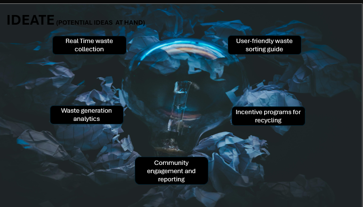
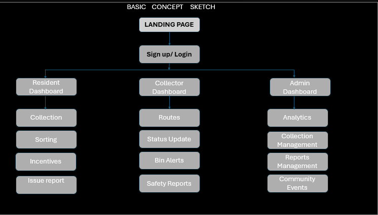

## ♻️ MSE AAMUE JINA 

This system is too provide and give a chance to the community at large to make a clean and presentable environment. 



These ideas above are to be clearly applied in this system.


##  ????? SYSTEM


## 🚀 Overview

This system supports three main user roles:

- **Resident:** Requests waste collection, accesses sorting guides, earns recycling incentives, and reports issues.  
- **Collector:** Views assigned routes, updates collection status, receives bin alerts, and submits safety reports.  
- **Admin:** Manages users, bins, routes, and monitors analytics and community reports.

---

## 🧩 Key Features

### 👤 Resident Dashboard
- Request and track waste collections  
- Interactive waste sorting guide (searchable by category)  
- Incentive program and reward tracking  
- Submit community or environmental issue reports  
- View personal waste analytics  

### 🚛 Collector Dashboard
- Access assigned routes with map view  
- Update collection status in real-time  
- Receive bin overflow or sensor alerts  
- Submit safety or route incident reports  

### 🛠️ Admin Panel
- Manage users (residents, collectors, admins)  
- Assign and monitor collection routes  
- View system analytics and community reports  
- Configure incentive programs and point rewards  

---

## 🧠 System Architecture

| Component | Technology |
|------------|-------------|
| Framework | Laravel |
| Database | MySQL |
| Server OS | Ubuntu |
| IDE | VS Code |
| Authentication | Laravel Breeze / Laravel UI |
| Role Management | Spatie Laravel Permission |
| Real-Time Updates | Laravel WebSockets / Pusher |
| Charts / Reports | Chart.js / ConsoleTVs/Charts |
| Maps | Google Maps API / Leaflet.js |

---

## 🗄️ Database Entities

**Core tables:**
- `users` (with roles: resident, collector, admin)  
- `residents` (profile + household info)  
- `collectors` (profile + vehicle info)  
- `pickups` (waste collection requests)  
- `routes` & `route_stops` (collection paths)  
- `bins` (location, type, fill level)  
- `reports` (issues & safety reports)  
- `incentives` & `incentive_transactions` (reward tracking)

---

| Member       | Role                      | Responsibilities                                                                        |
| ------------ | ------------------------- | --------------------------------------------------------------------------------------- |
| **Member 1** | **Backend Developer**     | Builds the main system logic — handles database, models, controllers, and APIs.         |
| **Member 2** | **Frontend Developer**    | Designs and builds user interfaces (Resident, Collector, Admin dashboards).             |
| **Member 3** | **Database Manager**      | Creates and manages tables, migrations, and reports for analytics.                      |
| **Member 4** | **Real-Time Developer**   | Sets up live updates (for bin alerts and collection status) using WebSockets or Pusher. |
| **Member 5** | **System Admin & Tester** | Manages the Ubuntu server, testing, and overall project deployment.                     |

| Layer                       | Main Tools                              | Responsible Member |
| --------------------------- | --------------------------------------- | ------------------ |
| **Routing & Controllers**   | Laravel Routes & Controllers            | Member 1           |
| **Views & Templates**       | Laravel Blade, HTML, CSS, JS            | Member 2           |
| **Database & Models**       | MySQL, Eloquent ORM                     | Member 3           |
| **Real-Time Communication** | Pusher / Laravel WebSockets             | Member 4           |
| **Deployment & Testing**    | Ubuntu Server, PHPUnit, Laravel Artisan | Member 5           |


## 🧭 Role-Based Access Flow

| User Role | Access Path | Dashboard |
|------------|--------------|------------|
| Resident | `/resident` | Collection, Sorting, Incentives, Reports |
| Collector | `/collector` | Routes, Status Updates, Bin Alerts, Safety Reports |
| Admin | `/admin` | Manage Users, Bins, Analytics |

Automatic redirection after login:
```php
protected function authenticated(Request $request, $user)
{
    if ($user->role === 'resident') return redirect('/resident');
    if ($user->role === 'collector') return redirect('/collector');
    if ($user->role === 'admin') return redirect('/admin');
}
