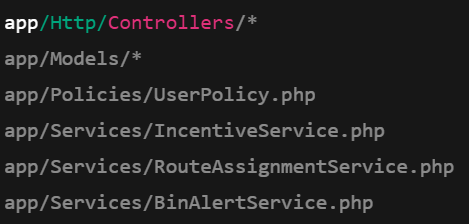
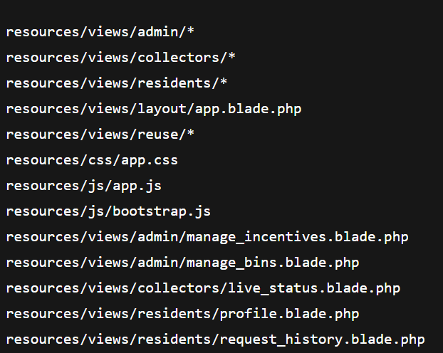
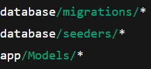
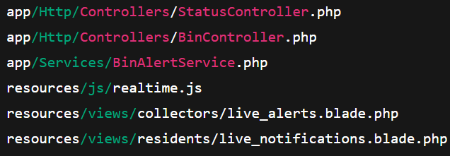
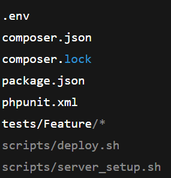

# WASTEMANAGEMENT SYSTEM
Overview

The Waste Management System (MSE AAMUE JINA) allows residents, collectors, and admins to manage waste collection efficiently. The system promotes a clean and presentable environment by providing real-time updates, incentives, and community reporting.

User Roles:

Resident: Request collections, track incentives, report issues, access sorting guides.

Collector: View assigned routes, update collection status, receive bin alerts, submit safety reports.

Admin: Manage users, bins, routes, analytics, and incentive programs.

Project Structure & File Assignments
1. Backend Developer

Responsible for: Core system logic, controllers, models, and APIs.
Files:

2. Frontend Developer

Responsible for: Designing and implementing user interfaces for all dashboards.
Files:

3. Database Manager

Responsible for: Creating and managing tables, migrations, seeders, and reports.
Files:

4. Real-Time / Notifications Developer

Responsible for: Implementing live updates for bin alerts, collection status, and notifications.
Files:

5. System Admin & Tester

Responsible for: Deployment, server setup, and testing the system.
Files:

